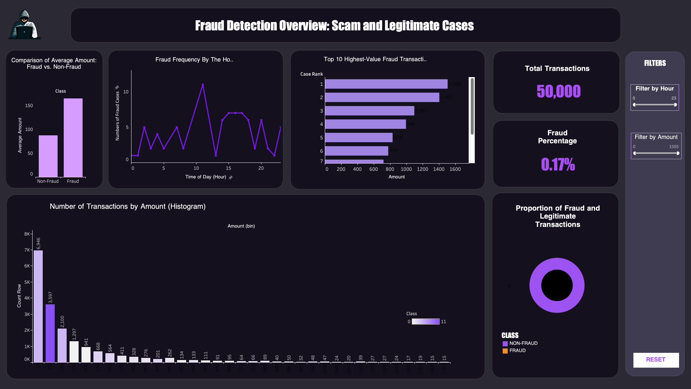

# Credit Card Fraud Detection: Scam and Legitimate Cases

## Overview

The main goal of this project is to analyse transaction data to identify patterns and anomalies related to fraudulent activities. 
It includes:
 - Data extraction and transformation using **SQL** 
 - Detailed data exploration and preprocessing performed in Python (Jupyter Notebook)
 - Creation of insightful interactive dashboard to present key findings and support decision-making

## Dataset

 * Source: The dataset is a subset (creditcard_subset.csv) derived from the Kaggle Credit Card Fraud Detection dataset due to its large size, containing 50,000 transactions. 

 * Key Columns:
    - `Time`: Transaction timestamp (in seconds).
    - `V1–V28`: Principal components from PCA transformation (anonymized features).
    - `Amount`: Transaction amount in EUR.
    - `Class`: Binary label (0 = Legitimate, 1 = Fraud, ~0.17% fraud rate).

 * Additional Tables:   
    - `fraud_by_hour.csv`: Hourly fraud counts.
    - `amount_by_fraud.csv`: Average amounts by class.
    - `top_fraud_days.csv`: High-fraud days with amounts.

## Dashboard Preview

Link to view: [HERE](https://public.tableau.com/app/profile/ivy.kepiro/viz/FraudDetectionOverview/Dashboard3)
 
*Dashboard is a work in progress and may be updated.*

## Methodology
- **Data Cleaning**: Removed duplicates and handled missing values in `creditcard_subset.csv`
- **Exploratory Analysis**: Calculated fraud percentage (~0.17%) and aggregated data by hour and amount
- **Segmentation**: Categorised transactions into fraud and legitimate classes using Class.

Visualisation: Created a histogram of Amount bins, line charts for fraud frequency, and an interactive Tableau dashboard with filters (Hour and Amount) and KPIs (Fraud Percentage, Total Fraud Cases).

## Findings
- **Fraud Prevalence**: Approximately 0.17% of transactions are fraudulent (~85 out of 50,000), consistent with the Kaggle dataset.
- **Amount Distribution**: Fraud transactions average €164.23, while legitimate ones average €87.25, indicating higher-value frauds.
- **Time Patterns**: Fraud peaks vary by hour, with potential clustering (visualised in the dashboard).
- **Insight**: High-spending users (e.g., >€500) contribute to a disproportionate share of fraud cases, suggesting targeted monitoring.

 

Thank you for reviewing my work! 🙂  
Feel free to explore and reach out.

