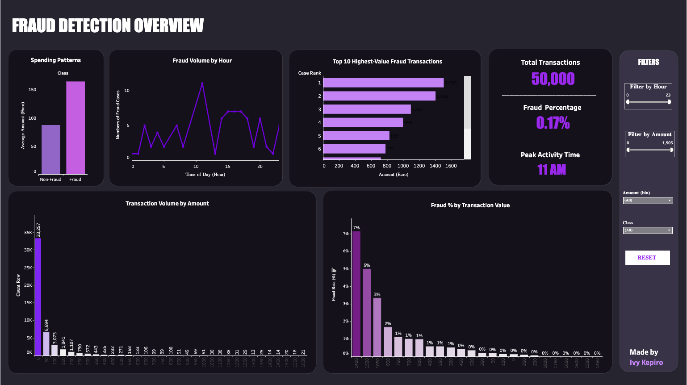

# Credit Card Fraud Detection: Scam and Legitimate Cases


## Table of Contents
- [Project Overview](#overview)
- [Dataset](#dataset)
- [Project Workflow](#project_workflow)
- [Project Structure](#project_structure)
- [Methodology](#methodology)
  - [1. Data Cleaning](#1-data-cleaning)
  - [2. Exploratory Data Analysis (EDA)](#2-exploratory-data-analysis-eda)
  - [3. Machine Learning Approach](#3-machine-learning-approach)
  - [4. Visualisation](#4-visualisation)
- [Dashboard Preview](#dashboard-preview)
- [Findings](#findings)
- [How to Use](#how-to-use)
- [References](#references)

## Overview

Credit card fraud is a significant challenge for financial institutions and consumers, leading to substantial financial losses and undermining trust in digital payment systems. Detecting fraudulent transactions quickly and accurately is essential for minimising risk and protecting users.

This project explores the application of machine learning techniques to detect potentially fraudulent credit card transactions, using a real-world dataset of anonymised transaction records.
The primary objectives include analysing transaction data to uncover patterns and anomalies associated with fraud. 

To support this analysis, interactive data visualisations were created in Tableau, focusing on transaction patterns, fraud prevalence, and high-risk behaviors identified during exploratory data analysis.  This allows stakeholders to filter, drill down, and monitor fraud risk in an accessible and actionable format.

Key components of the project:
 - Extracted and transformed data using SQL
 - Performed detailed data exploration and preprocessing with Python in a Jupyter Notebook
 - Built and evaluated a predictive model to classify transactions as legitimate or fraudulent
 - Developed an interactive Tableau dashboard to present key insights and support data-driven decision-making

## Dataset

 * Source: The dataset is a subset (`creditcard_subset.csv`) derived from the Kaggle Credit Card Fraud Detection dataset due to its large size, containing 50,000 transactions. 

 * Key Columns:
    - `Time`: Transaction timestamp (in seconds).
    - `V1`–`V28`: Principal components from PCA transformation (anonymised features).
    - `Amount`: Transaction amount in EUR.
    - `Class`: Binary label (0 = Legitimate, 1 = Fraud, ~0.17% fraud rate).

 * Additional Tables:   
    - `fraud_by_hour.csv`: Hourly fraud counts.
    - `amount_by_fraud.csv`: Average amounts by class.
    - `top_fraud_days.csv`: High-fraud days with amounts.

## Project Workflow
The project starts by loading a subset of credit card transactions into an SQLite database for easy querying. Example SQL queries used to analyse the data include:
```sql
-- Count of fraudulent transactions by hour of the day
SELECT CAST((Time / 3600) % 24 AS INTEGER) AS Hour, COUNT(*) AS Fraud_Count
FROM transactions
WHERE Class = 1
GROUP BY Hour
ORDER BY Hour ASC;
  ```

Next, data cleaning and exploratory analysis are performed in Python to ensure data quality and understand patterns.

A machine learning pipeline is then built using a Random Forest classifier to detect fraudulent transactions. This pipeline includes data preprocessing, model training, evaluation, and threshold tuning to balance precision and recall.

Finally, key insights and results are presented through an interactive Tableau dashboard, enabling easy exploration of fraud trends.


## Project Structure

- `Notebooks/01_creditcard_fraud_preprocessing.ipynb`: Data cleaning, feature engineering, and preprocessing. Outputs a processed dataset for modeling.
- `Notebooks/02_machine_learning.ipynb`: Exploratory data analysis, model building, evaluation, and visualisation.
- `Data/`: Contains raw and processed datasets.


## Methodology

This project follows best practices for transparent, reproducible machine learning:

### Data Cleaning
 * Removed duplicates and handled missing values in creditcard_subset.csv.

### Exploratory Data Analysis (EDA)
 * Calculated fraud percentage (~0.17%) and aggregated data by hour and amount.
 * Analysed fraud prevalence: ~85 out of 50,000 transactions are fraudulent, consistent with the original Kaggle dataset.
 * Examined amount distribution: Fraudulent transactions average €164.23, while legitimate ones average €87.25, indicating higher-value frauds.
 * Explored time patterns: Fraud peaks vary by hour, with potential clustering visualised in the dashboard.
 * Identified high-value transactions: High-spending users (e.g., >€500) contribute disproportionately to fraud, suggesting a need for targeted monitoring.

### Machine Learning Approach
 * Model: Random Forest Classifier trained to predict fraud based on transaction features.
 * Evaluation: Used precision, recall, F1-score, and confusion matrix to assess model performance.
 * Threshold Tuning: Explored the trade-off between precision and recall by adjusting the decision threshold, with a focus on maximising precision to minimise false alarms.

### Visualisation
- "Histogram of transaction amounts", 
- "Line charts for hourly fraud frequency",
- "Precision-Recall vs. Threshold Plot: Demonstrates the trade-off between catching more frauds and reducing false positives."
- "Interactive Tableau dashboard with filters (Hour, Amount) and KPIs (Fraud Percentage, Total Fraud Cases)"

## Dashboard Preview


*Dashboard is a work in progress and may be updated.*
<br>
Link to view: [HERE](https://public.tableau.com/app/profile/ivy.kepiro/viz/FraudDetectionOverview/Dashboard3)


## Findings

  | Model     | Precision (Fraud) | Recall (Fraud) | F1 (Fraud) | Comments                              |
  |-----------|-------------------|----------------|------------|---------------------------------------|
  | Baseline  | 0.80              | 0.24           | 0.36       | High precision, low recall            |
  | Pipeline  | 0.89              | 0.47           | 0.62       | Better balance, more frauds detected  |


- **Fraud Prevalence**: Approximately 0.17% of transactions are fraudulent (~85 out of 50,000), consistent with the Kaggle dataset (the dataset is highly imbalanced).
- **Amount Distribution**: Fraud transactions average €164.23, while legitimate ones average €87.25, indicating higher-value frauds.
- **Time Patterns**: Fraud peaks vary by hour, with potential clustering (visualised in the dashboard).
- **Insight**: High-spending users (e.g., >€500) contribute to a disproportionate share of fraud cases, suggesting that high-value transactions may require targeted monitoring.
- **Precision-Recall Trade-off**: By increasing the decision threshold, the model achieves high precision (fewer false alarms) at the cost of lower recall (missing some frauds). This approach is suitable for minimising customer disruption in production environments.
<br>

## How to Use
1. Clone the repository.
2. Install required Python packages (see requirements.txt).
3. Run the Jupyter notebook in Notebook/machine_learning.ipynb to reproduce the analysis and model.
4. Use the exported creditcard_with_predictions.csv for further visualisation in Tableau or other BI tools.

## References
 * [scikit-learn documentation](https://scikit-learn.org/stable/modules/compose.html)
 * [Step-by-step pipeline tutorial](https://towardsdatascience.com/step-by-step-tutorial-of-sci-kit-learn-pipeline-62402d5629b6/)
 * Code Institute bootcamp
 * Variety of AI tools for debugging

<br>

Thank you for reviewing my work! 🙂  
Feel free to explore and reach out.


[Back to Top](#)
